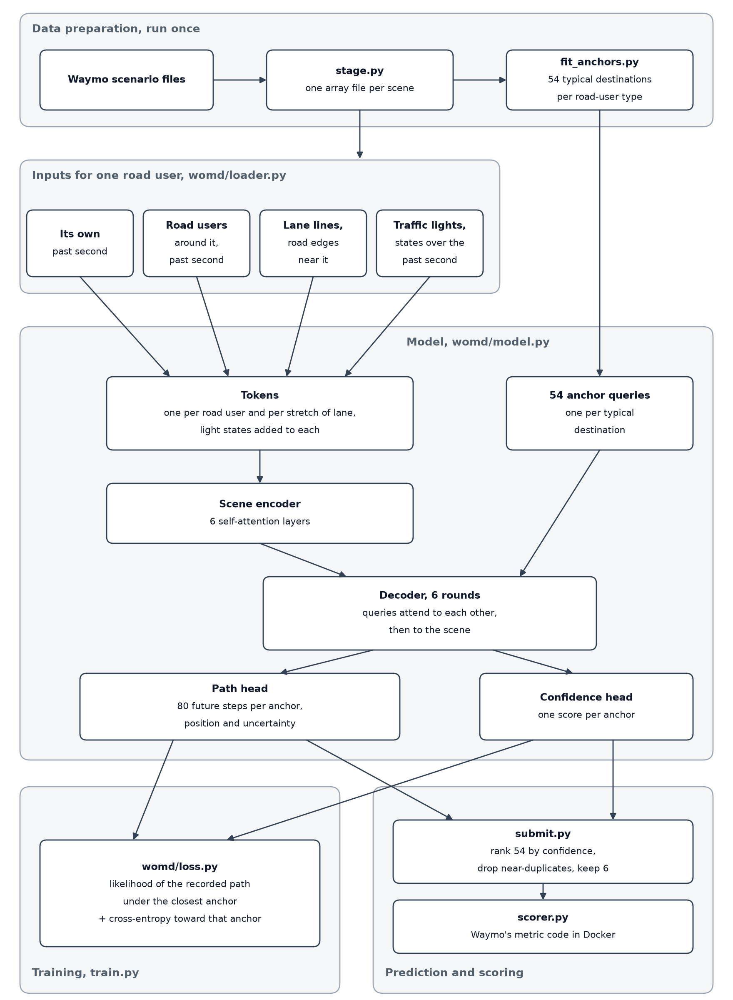

# MotionNet

A Python program that predicts where cars, cyclists and pedestrians
will move next, from recorded autonomous-driving data.

A Waymo car records the scene around it: where each road user has been
for the past second, the lane lines, the state of the traffic lights.
From that one second, this program predicts the next eight — six
possible paths per road user, each with a confidence. A car approaching
a junction may turn or continue straight, and a single prediction would
average the two.

{{DATA DERVED IMAGE TO COME}}

## How well it works

minADE is the standard score: the average distance, in metres, between
the recorded path and whichever of the six predictions came closest.
Lower is better. Waymo's own scoring code produced these numbers on the
44,097 held-out scenes of the validation split:

| minADE (m)  | 3 s  | 5 s  | 8 s  |
|-------------|------|------|------|
| cars        | 0.36 | 0.79 | 1.55 |
| pedestrians | 0.19 | 0.37 | 0.64 |
| cyclists    | 0.38 | 0.73 | 1.32 |

The control, scored through the same code, assumes every road user
holds its current speed and heading. At 8 s it scores 10.98 m for cars,
1.55 m for pedestrians and 4.17 m for cyclists.

These numbers are not comparable to the public leaderboard. This model
trains on a quarter of the training split: 122,352 scenes, 16 epochs,
two 12-hour sessions on a free Kaggle GPU.

## How it works

1. Waymo's files are unpacked by this repository's reader and reduced
   to numeric arrays, one file per scene. The reader is checked
   byte-for-byte against Waymo's.
2. Before training, the endpoints of every training path are clustered
   into 54 typical destinations per road-user type: straight and far,
   gentle left, hard right. These are the anchors.
3. A transformer encodes the scene and, for each anchor, adjusts that
   anchor's path to fit it. A second head scores how likely each anchor
   is. The loss is the paper's (MultiPath, Chai et al. 2019): each
   training example trains the path of the anchor closest to the
   recorded path, and trains the confidence toward that same anchor.
4. At prediction time the 54 are ranked by confidence, near-duplicates
   are dropped, and the six highest are kept.

## Run it

Tests need no data: `./gate.sh` (45 tests). Training runs from
`train.py`, scoring from `scorer.py`, which drives Waymo's metric code
in a Docker container. Waymo does not permit redistribution of their
data, so reproducing the table requires a Waymo Open Motion Dataset
account; `stage.py` converts their files into this repository's format.

## Architecture

